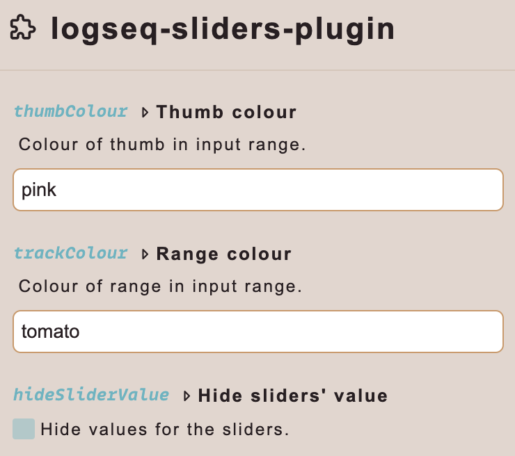

[:gift_heart: Sponsor this project on Github](https://github.com/sponsors/hkgnp) or [:coffee: Get me a coffee](https://www.buymeacoffee.com/hkgnp.dev) if you like this plugin!

# Introduction

This simple plugin inserts a slider into your note to serve as a great visualisation tool!

# Usage

Type `/Insert slider` and that's it!

# Customising range

In order to customise the range of the slider, simply add a value to the end of the block where in the example below, 100 is the maximum range (default: 10).

`[:div {:is "slider-jlvafjj"}100]`

# Hiding the values of the slider rangers

By default, sliders will have their values shown. If you wish to hide it, simply head to the plugin settings, and check the box to hide it.

# Changing the colours of the track and the thumb

In the same settings box above, you can also change the colours of the track and the thumb of your sliders.

# Installation

If not available from the marketplace, simply download the release and manually load it into Logseq after unzipping it.
